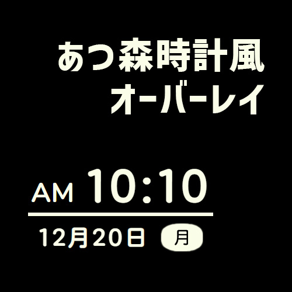
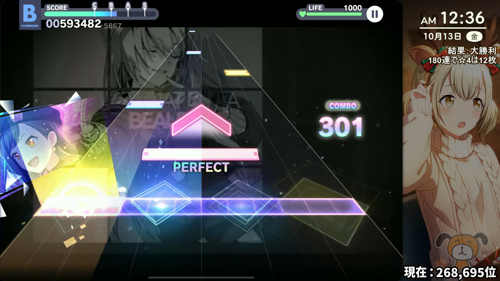

<p align="center">
  <a href="https://ririo08.github.io/Atsumori-clock-Overlay" target="_blank" rel="noopener noreferrer">
    
  </a>
</p>

<h1 align="center">あつまれどうぶつの森風時計オーバーレイ</h1>

<p align="center">
OBS / Xsplit 等配信ソフト向け時計オーバーレイ
</p>

<p align="center">
  
  <a href="https://github.com/ririo08/Atsumori-clock-Overlay/actions/workflows/ci_main.yml">
    
  </a>
</p>

<br />

<p align="center">
  <a href="https://ririo08.github.io/Atsumori-clock-Overlay" target="_blank" rel="noopener noreferrer" >
    
  </a>
</p>

## これは何？

配信ソフト向けのオーバーレイです。  
[あつまれ どうぶつの森](https://www.nintendo.co.jp/switch/acbaa/index.html)のプレイ中、動きを止めていると左下に出てくる時計を再現したものになります。  
実際の日時に合わせて変動するので、「配信がいつ行われているか」などの利用を想定して作っています。

## 使い方

詳しくは[あつまれどうぶつの森風時計オーバーレイ](https://ririo08.github.io/Atsumori-clock-Overlay)を参照してください。

## 利用規約

基本的にはMITライセンスとしていますが、可能であれば以下の文章を説明欄に貼っていただけるととても喜びます。

```
あつまれどうぶつの森の時計風オーバーレイ
https://ririo.dev/Atsumori-clock-Overlay/
```

## 注意事項

このサービスはGithub上に公開されており、サーバーダウン時やそのほかの問題により表示が崩れる・表示されない場合があります。  
その場合はこのトップページをブラウザから確認していただき、再度リンクの生成をお願いいたします。  
また、このサービスは非公式であり、任天堂とは一切関係ございません。任天堂に問い合わせを行うのはご遠慮ください。  
破壊的な変更点等がある場合はこのページにも記載いたしますが、リリース情報をご確認して頂ければと思います。

## コントリビュート

issue, PR等大歓迎です！  
なにか不明な点や気になる点がありましたらIssueまたはリリオのツイッターやYouTubeまでご連絡ください。

## Setup

Development:

```cmd
bun i
bun dev
```

Build:

```
bun generate
```

## Testing

今のところ未実装（時計の検証は [date-fns](https://date-fns.org/) に丸投げしています）

## コントリビューﾀ

<a href="https://github.com/ririo08/Atsumori-clock-Overlay/graphs/contributors">
  
</a>
